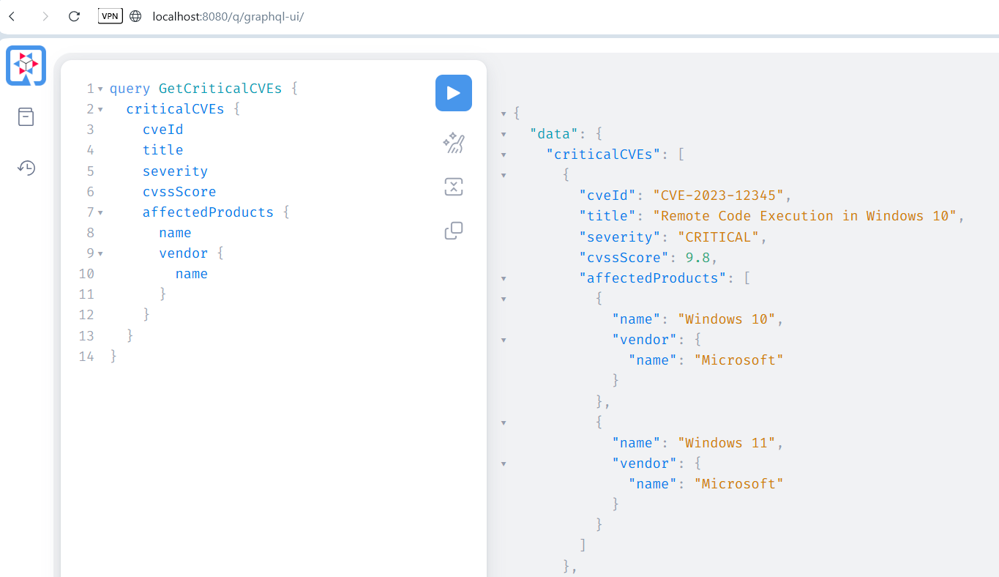
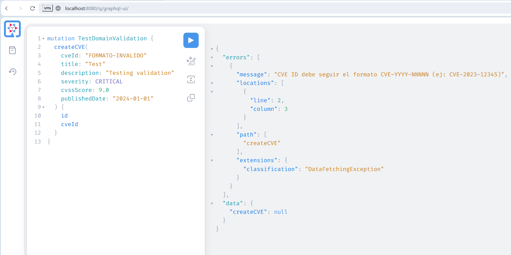
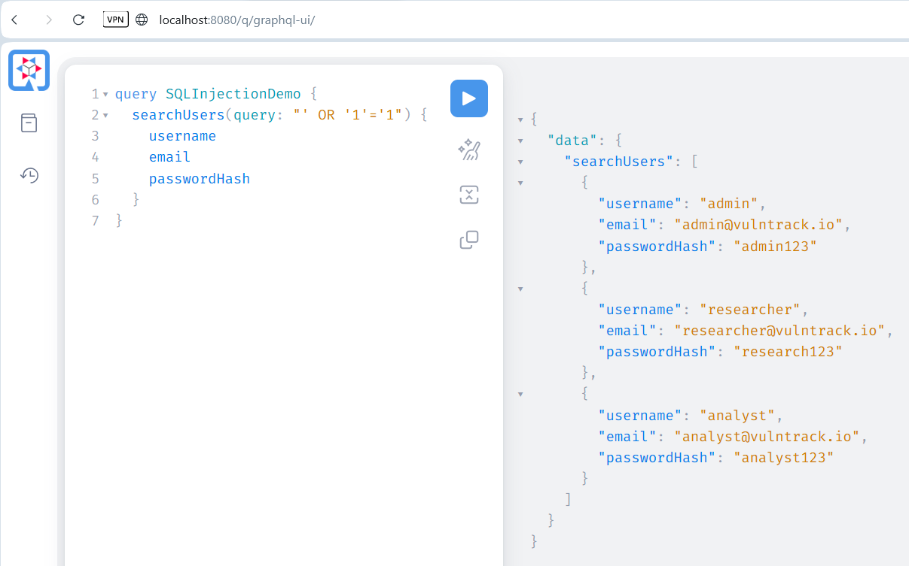
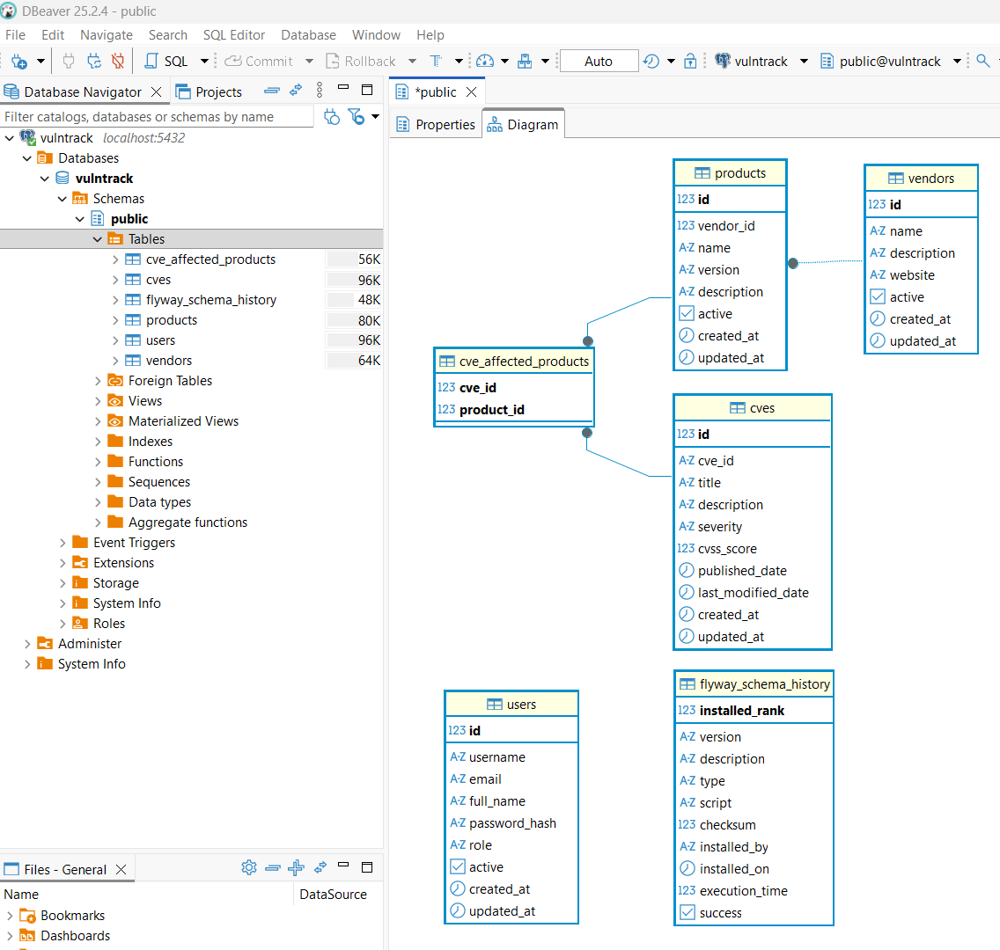
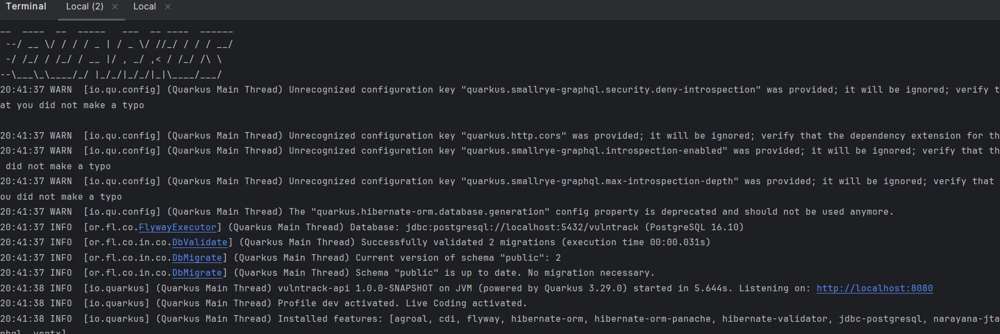

# VulnTrack API - GraphQL Security Assessment

Sistema de gestión de vulnerabilidades (CVE) desarrollado como parte del TFM en Ciberseguridad de UNIR.

**Objetivo**: Demostrar vulnerabilidades específicas de GraphQL y estrategias de mitigación siguiendo principios de Secure by Design.

## Stack Tecnológico

- **Framework**: Quarkus 3.29.0
- **Lenguaje**: Java 21
- **API**: SmallRye GraphQL
- **Base de datos**: PostgreSQL 16
- **ORM**: Hibernate ORM with Panache
- **Migraciones**: Flyway

## Arquitectura

El proyecto sigue Domain-Driven Design (DDD) con énfasis en Domain Primitives.

La arquitectura se organiza en:
- **Domain Layer**: Entidades (User, CVE, Product, Vendor) y Domain Primitives (CVEId, Email, Username, Severity)
- **Application Layer**: Lógica de negocio encapsulada en las entidades
- **Infrastructure Layer**: GraphQL Resources y acceso a datos con Panache

Para más detalles, ver [documentación de arquitectura](docs/architecture.md).

## Setup del Proyecto

### Prerequisitos

- Java 21 instalado
- Docker Desktop corriendo
- Maven 3.9+

### 1. Levantar la base de datos
```bash
docker-compose up -d
```

Esto levanta PostgreSQL 16 en el puerto 5432.

### 2. Compilar el proyecto
```bash
./mvnw clean compile
```

### 3. Ejecutar en modo dev
```bash
./mvnw quarkus:dev
```

La aplicación estará disponible en:
- **API GraphQL**: http://localhost:8080/graphql
- **GraphQL UI**: http://localhost:8080/q/graphql-ui

## Fases del Desarrollo

### Fase 1: Baseline Vulnerable (Actual)

**Objetivo**: Implementar API funcional SIN controles de seguridad para demostración académica.

**Implementado:**
- Domain Primitives (CVEId, Email, Severity, Username, VendorName, ProductName)
- Modelo de dominio completo con relaciones ManyToOne y ManyToMany
- GraphQL API con queries y mutations
- Sin autenticación (cualquiera puede ejecutar queries)
- Sin autorización (escalación de privilegios posible)
- Introspection habilitada (atacante puede mapear la API)
- SQL Injection presente en searchUsers y searchCVEs
- Passwords en texto plano

**Branch**: `entrega-1-baseline`

**Vulnerabilidades demostradas**: 7 (5 críticas, 1 alta, 1 media)

---

### Fase 2: Security Hardening (Próxima)

**Planificado:**
- JWT Authentication con SmallRye JWT
- RBAC (Role-Based Access Control)
- BCrypt password hashing
- SQL Injection mitigation con queries parametrizadas
- Query depth limiting
- Introspection disabled

**Branch**: `entrega-2-security`

---

### Fase 3: Testing & Validation (Final)

**Planificado:**
- Tests de seguridad automatizados
- Scripts de ataque (Python)
- Benchmarking
- Documentación completa

**Branch**: `entrega-3-testing`

---

## Principios de Secure by Design Aplicados

### Domain Primitives

Cada concepto del dominio tiene su propio tipo con validación encapsulada:
```java
// ANTES (vulnerable)
public void createCVE(String cveId, String email) {
    // No hay validación, cualquier string es aceptado
}

// DESPUÉS (seguro)
public void createCVE(CVEId cveId, Email email) {
    // Si el objeto existe, es válido por diseño
}
```

**Ejemplos implementados:**
- `CVEId`: Valida formato CVE-YYYY-NNNNN y rango de años (1999-2100)
- `Email`: Valida formato RFC con regex, máximo 254 caracteres
- `Username`: 3-30 caracteres, lowercase, alfanumérico
- `Severity`: Enum con lógica de negocio (fromCvssScore(), isCriticalOrHigh())

### Fail-Fast

Las validaciones ocurren en el constructor. Un objeto inválido no puede ser creado:
```java
CVEId.of("invalid");  // Lanza IllegalArgumentException inmediatamente
CVEId.of("CVE-2023-12345");  // Retorna CVEId válido
```

### Inmutabilidad

Todos los Domain Primitives son inmutables (final class, no setters), previniendo modificaciones no controladas.

---

## Evidencia Visual del Desarrollo

### 1. GraphQL API Funcionando

Consulta de CVEs críticos con productos afectados:



La API retorna CVE-2023-12345 (Remote Code Execution in Windows 10) con severidad CRITICAL (9.8) y productos afectados (Windows 10, Windows 11).

---

### 2. Validación de Domain Primitives

Domain Primitive `CVEId` rechazando formato inválido:



El Domain Primitive valida el formato CVE-YYYY-NNNNN en el constructor. Un objeto inválido no puede ser creado, previniendo datos corruptos.

---

### 3. Demostración de Vulnerabilidad - SQL Injection

SQL Injection en `searchUsers` permitiendo bypass:



Esta vulnerabilidad es intencional para fines demostrativos (Fase 1 - Baseline Vulnerable). La query `' OR '1'='1` retorna todos los usuarios con sus passwords en texto plano.

CVSS Score: 9.8 (Critical)  
Mitigación: Será implementada en Fase 2 usando Panache queries parametrizadas.

---

### 4. Esquema de Base de Datos

Estructura normalizada con constraints y Flyway:



5 tablas principales: users, vendors, products, cves, cve_affected_products  
Relaciones: ManyToOne (Product → Vendor), ManyToMany (CVE ↔ Product)  
Control de versiones: flyway_schema_history (2 migraciones)

---

### 5. Aplicación en Ejecución

Quarkus 3.29.0 arrancando con Flyway migrations:



Tiempo de arranque: 5.644s en modo dev  
Migraciones ejecutadas: V1 (schema inicial), V2 (seed data)  
Features activas: Panache, GraphQL, Flyway, PostgreSQL

---

## Documentación Complementaria
**[GRAPHQL_QUERIES.md](docs/graphql_queries.md)**  
Colección completa de queries y mutations para probar la API. Incluye ejemplos por recurso (Users, Vendors, Products, CVEs).

**[ATTACKS.md](docs/attacks.md)**  
Documentación técnica de 7 vulnerabilidades ejecutables:
- SQL Injection (searchUsers, searchCVEs)
- Broken Access Control (sin autenticación, escalación de privilegios)
- Information Disclosure (passwords en texto plano)
- Denial of Service (queries circulares, sin paginación)

Los ataques documentados son intencionales para fines académicos. Fase 1 = Baseline Vulnerable, Fase 2 = Mitigación.

---

## Referencias

### Libros

- **Black Hat GraphQL** (Dolev Farhi & Nick Aleks, 2023)  
  Capítulos 4-8: Authentication, Authorization, DoS, Information Disclosure

- **Secure by Design** (Manning, 2019)  
  Domain Primitives, Fail-Fast, Immutability

### Estándares

- **OWASP API Security Top 10** (2023)
- **OWASP GraphQL Cheat Sheet**

### CWEs

- **CWE-89**: SQL Injection
- **CWE-287**: Improper Authentication
- **CWE-862**: Missing Authorization

---

## Comandos Útiles
```bash
# Compilar
./mvnw clean compile

# Ejecutar tests
./mvnw test

# Modo dev (hot reload)
./mvnw quarkus:dev

# Generar distribución
./mvnw package

# Detener Docker
docker-compose down

# Ver logs de la DB
docker-compose logs -f postgres
```

---

## Notas del Desarrollo

Este proyecto es parte del TFM "Seguridad en APIs GraphQL con Quarkus: Evaluación de Vulnerabilidades y Estrategias de Mitigación desde un Enfoque Secure by Design".

### Metodología

El desarrollo sigue una aproximación iterativa con tres fases:

**Fase 1 - Baseline Vulnerable**: Implementación intencional de una API funcional pero insegura. Todas las vulnerabilidades están documentadas y son demostrables mediante queries GraphQL ejecutables.

**Fase 2 - Security Hardening**: Aplicación de controles de seguridad siguiendo mejores prácticas. Cada vulnerabilidad de Fase 1 será abordada con técnicas específicas.

**Fase 3 - Testing & Validation**: Automatización de tests de seguridad y validación de mitigaciones.

### Evidencia Académica

Cada fase se mantiene en su propia rama Git con commits descriptivos que documentan el proceso de desarrollo iterativo.

---

**Autor**: Bladimir Gonzales Miranda  
**Director**: Rubén Pérez Chacón  
**Universidad**: UNIR - Máster en Ciberseguridad  
**Fecha**: Noviembre 2025