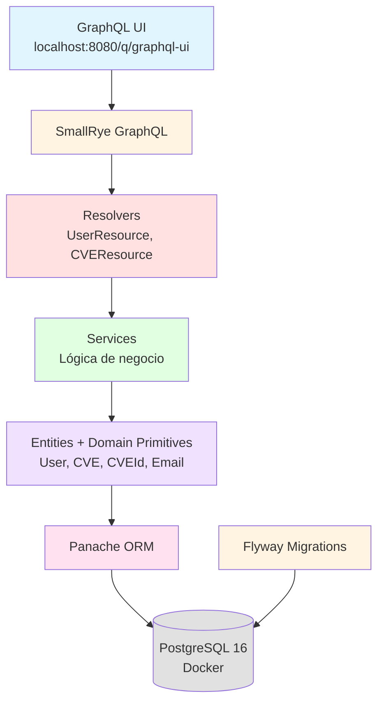

# Arquitectura del Sistema

## Diagrama de Componentes

## Capas de la Aplicación

### 1. Capa de Presentación
- **GraphQL UI**: Interfaz interactiva para explorar la API
- **SmallRye GraphQL**: Motor GraphQL integrado en Quarkus

### 2. Capa de Aplicación
- **Resolvers**: Exponen queries y mutations
- **DTOs**: Inputs para validación

### 3. Capa de Dominio
- **Entities**: User, Vendor, Product, CVE
- **Domain Primitives**: CVEId, Email, Username, Severity, Role
- **Lógica de negocio**: Métodos como `isCriticalOrHigh()`, `affectsVendor()`

### 4. Capa de Infraestructura
- **Panache**: Simplificación de Hibernate
- **PostgreSQL**: Base de datos relacional
- **Flyway**: Control de versiones del schema

## Patrones Aplicados

- **Domain-Driven Design (DDD)**: Modelo de dominio rico
- **Repository Pattern**: Abstracción del acceso a datos
- **Domain Primitives**: Validación encapsulada (Secure by Design)